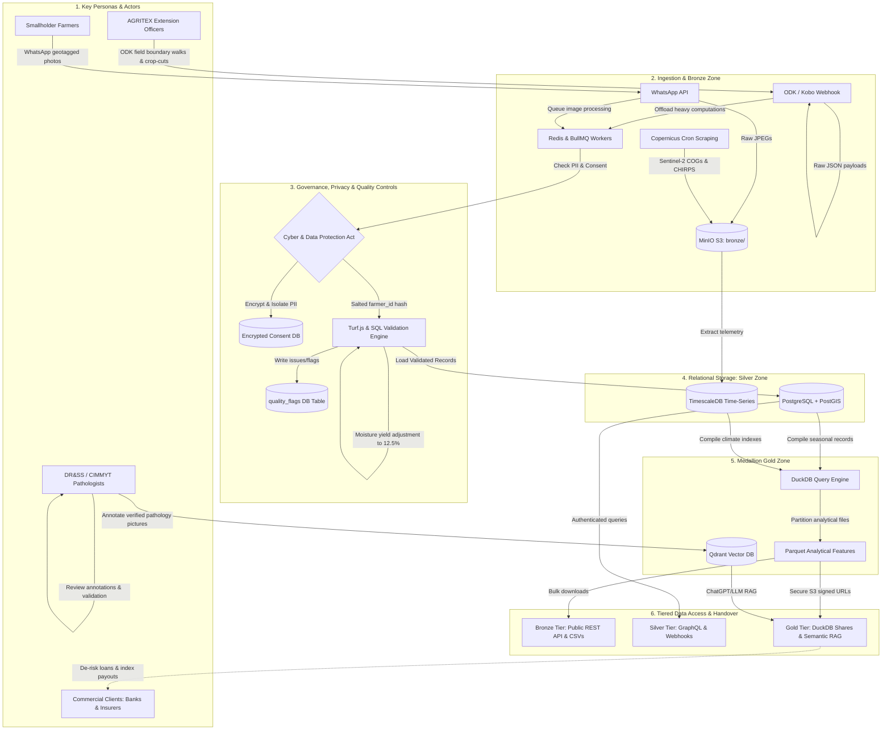

# GigaData Engine - Data Architecture & Processing Flow

This document details the end-to-end data pipeline of the GigaData Engine, highlighting the interactions between systems, user personas (people), and structural controls (data compliance, quality rules, and security).

---

## 1. End-to-End System Data Flow Diagram

---

## 2. Phase-by-Phase Technical Processing Flow

The GigaData Engine ingests, sanitizes, enriches, and packages agronomic telemetry through a structured pipeline:

### Phase 1: Data Ingestion & Bronze Zone (Immutable Raw Storage)
* **WhatsApp crowdsourced photos**: Smallholders upload crop disease pictures through a zero-rated WhatsApp bot. The raw JPEGs are directly pushed to MinIO S3 (`bronze/crop_health/`).
* **ODK/Kobo field surveys**: AGRITEX extension officers walk field boundaries to log farmer decisions and harvest crop-cuts. The raw JSON schema payloads hit the `POST /api/v1/ingest/odk` webhook.
* **Earth Observation (EO)**: Automation scripts scrape Copernicus Sentinel-2 multispectral rasters and CHIRPS precipitation indices, saving them as Cloud-Optimized GeoTIFFs (COGs).

### Phase 2: Privacy Anonymization & Governance Controls
To comply with the **Cyber and Data Protection Act (2021)**:
* **PII Decoupling**: Direct personal details (names, phone numbers, national IDs) are extracted from ODK payloads, encrypted, and isolated in the restricted-access `Consent Registry DB`.
* **Salted Pseudonymization**: Farmers are allocated a cryptographically salted `farmer_id` hash. All downstream analytical tables (farms, fields, seasons, yields) refer only to the `farmer_id` hash, guaranteeing PII is never exposed to analytical pipelines.

### Phase 3: Spatial & Agronomic Quality Verification
Before data migrates to the **Silver Zone**, the validation engine (`src/services/validationService.mjs`) executes rigorous automated checks:
1. **Geometric Containment**: Turf.js verifies that the field polygon coordinate arrays strictly reside within the bounding polygon of the parent farm.
2. **Key Constraints**: Validates relationships (e.g. confirming `field_season_id` exists before binding a crop cut).
3. **Moisture Content Adjustment**: Standardizes crop cuts. Fresh grain weight is mathematically adjusted to a standard 12.5% grain moisture content using the formula:
   $$\text{Adjusted Dry Weight} = \text{Fresh Weight} \times \frac{100 - \text{Measured Moisture \%}}{100 - 12.5}$$
4. **Issue Flagging**: Any records that fail checks (e.g. a coordinate falling outside Zimbabwe, or moisture above 35%) are registered in the `quality_flags` table with a `WARNING` or `FAIL` status, preventing them from automatically advancing to the gold tier.

### Phase 4: Structured Relational Storage (Silver Zone)
Anonymized and validated data is loaded into PostgreSQL (managed by Sequelize ORM):
* Geometries are stored as PostGIS spatial types (Point, Polygon) for spatial matching queries.
* High-frequency telemetry (weather station rainfall, wind speed, soil-rover sensor moisture) is directed to **TimescaleDB hypertables** partitioned by timestamp.

### Phase 5: Feature Engineering & Semantic indexing (Gold Zone)
* **OLAP Analytics**: DuckDB reads directly from the Silver database to compile multi-season aggregates. It partitions files and saves them as highly compressed **Apache Parquet** files in MinIO S3 (`gold/features/`).
* **Pathology Annotations**: DR&SS agronomists review unverified crop photos on the web portal. Once expert-confirmed, the images are stored as a model-agnostic crop health corpus, and semantic descriptors are vectorized and upserted to the **Qdrant Vector Database**.

### Phase 6: Tiered Handover & Dual-Serving
Data is monetized and distributed based on customer access privileges:
* **Bronze Tier (Open Access)**: Aggregated CSV data dictionary tables, generalised GeoJSON boundary maps, and public catalog endpoints served via standard REST endpoints.
* **Silver Tier (Controlled Commercial)**: Authenticated GraphQL API allowing CBZ/AFC bank loan systems to pull nested field history datasets using JWT/API tokens.
* **Gold Tier (Premium Sovereign)**: Insurers (EcoFarmer/Old Mutual) retrieve presigned URL download tokens to query gold-standard yield Parquet files directly using local DuckDB clients. AI builders consume semantic search embeddings from Qdrant to power ChatGPT/LLM RAG interfaces.
