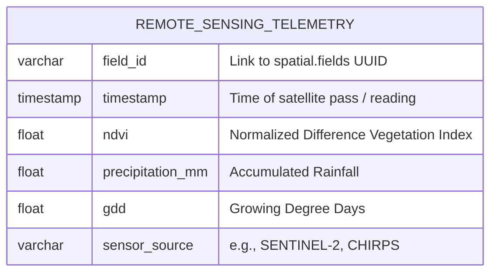

# DuckDB Analytics & Time-Series Structure

GigaData Engine leverages DuckDB as a fast, in-process analytical warehouse. It is specifically designed to handle time-series remote sensing data (e.g. Sentinel-2 NDVI telemetry) and climate metrics (precipitation, GDD) for rapid aggregation before serving it to the Map Explorer frontend.

## Analytical Schema Structure

DuckDB operates on flattened, denormalized columnar tables optimized for OLAP queries.



## Data Flow (Postgres -> MinIO -> DuckDB)

1. **Extraction**: Raw time-series data is ingested and saved as immutable Parquet files in the `silver/` MinIO buckets.
2. **Virtualization**: DuckDB does not hold the data permanently in memory. Instead, it queries the MinIO Parquet files directly via HTTP/S3 endpoints.
   ```sql
   SELECT timestamp, ndvi, precipitation_mm 
   FROM read_parquet('s3://gigadata-lakehouse/silver/telemetry/*.parquet')
   WHERE field_id = 'fld-001'
   ORDER BY timestamp ASC;
   ```
3. **Serving**: The `mapController` triggers these DuckDB queries to dynamically generate the JSON responses required for the frontend time-series charts.
