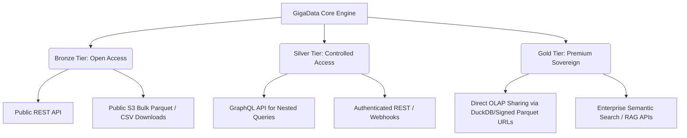

# Implementation Plan - GigaData Engine Comprehensive Master Architecture

We will implement the GigaData Engine as a sovereign **Geospatial Medallion Lakehouse** hosted on the **ZCHPC** supercomputing infrastructure. It will serve as the unified evidence layer linking climate exposure, farmer decisions, crop health, and measured harvest outcomes at the field-season level in Zimbabwe.

---

## 1. Lakehouse Architecture & Storage Strategy

Data is partitioned into three logical zones inside a sovereign **MinIO S3 Object Store** and queryable via **PostgreSQL + PostGIS** (managed by **Sequelize ORM**), **Qdrant / pgvector** (vector search), and **DuckDB**.

```
MinIO S3 (gigadata-lakehouse/)
├── bronze/ (Raw, immutable ODK JSONs, raw WhatsApp JPEGs, raw Copernicus GeoTIFFs)
├── silver/ (Cleaned, anonymised tables in Parquet; cropped & normalized crop health images)
└── gold/   (Gold-standard annotated image datasets, validated yield tables, ready for AI pipelines)
```

---

## 2. Core Datasets & Tiered Access Architectures

To monetize and secure GigaData assets, data retrieval is split into **three access classes and tiers**, each utilizing an appropriate architecture:



### 2.1 Bronze Tier (Open Access/Generalised Data)
* **Target Audience**: Researchers, open-source AI developers, public policy academics.
* **Data Scope**: 
  * Generalised plant disease photos (location generalisation to general district coordinates).
  * District/Ward-level crop yield averages (no field-level polygons).
  * Public Copernicus satellite NDVI grids.
* **Retrieval Architecture**:
  * **Public REST API**: Standard, unauthenticated endpoints serving dataset catalogs, schemas, and broad district statistics.
  * **S3 Bulk Download**: Direct download links to static `.csv` and `.parquet` files stored in public MinIO buckets.

### 2.2 Silver Tier (Controlled Commercial Access)
* **Target Audience**: Seed and input companies (Seed Co, Windmill, ZFC), commercial banks (CBZ, AFC), NGOs.
* **Data Scope**:
  * Precise field polygons, crop choices, crop history, and crop-cut yield measurements.
  * Anonymized datasets with farmer PII replaced by cryptographically salted hashes.
* **Retrieval Architecture**:
  * **Authenticated REST API**: Secured via API keys and OAuth2 (using Keycloak). Enables per-query pricing.
  * **GraphQL API**: Implemented to allow clients (like bank credit engines) to make nested queries (e.g. querying a farm, its fields, field seasons, and historic yields in a single call) to minimize network overhead.
  * **Webhooks Subscription**: Asynchronous notifications pushed to subscribers when regional data updates occur (e.g., alert sent to Seed Co when crop migration trends shift significantly in natural regions).

### 2.3 Gold Tier (Premium Sovereign/Controlled Access)
* **Target Audience**: Crop Insurers (EcoFarmer, Old Mutual), government decision-makers (Ministry of Agriculture, WFP), large contract-farming off-takers (GMB, Delta Corporation).
* **Data Scope**:
  * Exact field geometry overlays, historical time-series weather telemetry, expert plant pathology annotations, and exact harvest logs.
* **Retrieval Architecture**:
  * **Lakehouse Direct Share (OLAP Architecture)**: Direct read-only database shares using DuckDB query engines reading directly from versioned, read-only `.parquet` folders on S3 via secure, presigned S3 URLs. This allows insurers to perform large analytical queries (OLAP) on millions of rows without degrading transactional API performance.
  * **Semantic RAG APIs**: Premium semantic search endpoints exposing vectorized agronomic handbooks and pathology logs (connected to Qdrant) for ChatGPT/LLM RAG integrations.

---

## 3. Core API Endpoint Catalog

The backend engine will expose the following routes, structured by data category and functional use-case:

### 3.1 Ingestion & Pipeline Webhooks
* **`POST /api/v1/ingest/odk`**
  * **Data Category**: Raw Survey & Geometries (Bronze Zone).
  * **Use-Case**: Receives Kobo/ODK submission payloads from AGRITEX extension officers. Parses spatial coordinates, calculates moisture-adjusted dry weight, validates boundary containment checks, and queues records for PG/MinIO storage.
* **`POST /api/v1/ingest/whatsapp-media`**
  * **Data Category**: Unprocessed Crowdsourced Imagery (Bronze Zone).
  * **Use-Case**: Receives crop condition photos sent by smallholders via the WhatsApp Business API. Stores raw JPEGs in MinIO S3 and registers verification requests for agronomists.

### 3.2 Dataset Discovery & Handover
* **`GET /api/v1/datasets`**
  * **Data Category**: Metadata Catalog (Bronze Tier).
  * **Use-Case**: Open catalog listing available datasets, fields, licensing terms, update cycles, and direct download links.
* **`GET /api/v1/datasets/:id/sample`**
  * **Data Category**: Generalised Sample (Bronze Tier).
  * **Use-Case**: Exposes a tiny, generalized representative sample (CSV format) of a dataset for evaluation before licensing.
* **`GET /api/v1/datasets/:id/download`**
  * **Data Category**: Gold-Standard Structured Lakehouse Data (Gold Tier).
  * **Use-Case**: Generates direct, secure presigned S3 URLs for authenticated off-takers to query versioned GeoParquet files.

### 3.3 Spatial Maps & Remote Sensing Telemetry
* **`GET /api/v1/map/boundaries`**
  * **Data Category**: Spatial Vector Polygons (Bronze/Silver Tier).
  * **Use-Case**: Serves GeoJSON boundaries for districts, wards, and licensed fields for rendering on GIS portals (QGIS/Web portals).
* **`GET /api/v1/map/indices/:field_id`**
  * **Data Category**: Crop Indexes & Weather Telemetry (Silver Tier).
  * **Use-Case**: Serves historical daily NDVI timelines and daily moisture metrics for a specific field, letting insurers calibrate payouts and evaluate drought severity.

### 3.4 Commercial Finance & Agricultural Supply Chain
* **`GET /api/v1/credit/scores/:farmer_id`**
  * **Data Category**: Anonymized Credit Risk Index (Silver Tier).
  * **Use-Case**: Exposes "field credit scores" to commercial banks (**CBZ**, **AFC Bank**) based on smallholder history (experience, management timeliness score, crop yield consistency) to unlock financing without land titles.
* **`GET /api/v1/supply-chain/demand-forecast`**
  * **Data Category**: Aggregated Crop Coverage Stats (Silver Tier).
  * **Use-Case**: Provides seed and fertilizer suppliers (**Seed Co**, **Windmill**) with aggregated predictions of seasonal crop selections and planting windows by district to optimize input distribution.
* **`GET /api/v1/policy/yield-forecast`**
  * **Data Category**: Pre-Harvest Yield Estimations (Silver Tier).
  * **Use-Case**: Feeds aggregated pre-harvest yield predictions directly to the Ministry of Agriculture and WFP to plan strategic grain reserves and target anticipatory food aid.

### 3.5 AI & Chatbot RAG Integration
* **`POST /api/v1/chatbot/query`**
  * **Data Category**: Semantic Embeddings & Agronomic Advisory (Gold Tier).
  * **Use-Case**: Receives questions from farmers/extension officers, performs cosine similarity searches on Qdrant vector models, and returns expert advisory responses backed by DR&SS research.

### 3.6 Data Privacy, Consent & Governance
* **`POST /api/v1/consent/register`**
  * **Data Category**: Encrypted Consent Registry (Withheld / Restricted).
  * **Use-Case**: Registers a farmer's consent profile (storing names, phone numbers, and identity references separate from analytical pipelines) for compliance audits under the Cyber and Data Protection Act.
* **`POST /api/v1/consent/withdraw`**
  * **Data Category**: Governance Audit (Withheld / Restricted).
  * **Use-Case**: Handles farmer consent withdrawal. Flags the registry, triggering background workers to withhold or soft-delete that farmer's records from public releases.

---

## 4. Database Schema Blueprint & Sequelize Models

Rather than writing raw PostgreSQL scripts, database queries and schemas will be managed programmatically using **Sequelize ORM** (mapping to a PostGIS database), matching your other Node engines.

### 4.1 Database Connection Configuration (`src/config/database.mjs`)
```javascript
import { Sequelize } from "sequelize";
import dotenv from "dotenv";

dotenv.config();

export const sequelize = new Sequelize(
    process.env.DB_NAME || "giga_data_engine",
    process.env.DB_USER || "postgres",
    process.env.DB_PASSWORD || "12345",
    {
        host: process.env.DB_HOST || "127.0.0.1",
        port: Number(process.env.DB_PORT || 5432),
        dialect: "postgres",
        logging: false,
        dialectOptions: {
            application_name: "giga-data-engine-backend"
        }
    }
);
```

### 4.2 Sequelize Model Declarations (`src/models/`)

We will define modular models under `src/models/` that synchronize automatically:

1. **Farmer Model** (`src/models/Farmer.mjs`):
   * Pseudonymous demographic and consent status records.
   * `farmer_id` (Primary Key, unique salted hash).
   * `gender_code`, `age_band`, `preferred_language`, `province_code`, `district_code`, `ward_code`, `consent_status`.

2. **ConsentRegistryRestricted Model** (`src/models/ConsentRegistryRestricted.mjs`):
   * Isolates PII. Primary keys are linked to anonymized analytical tables.
   * `consent_record_id`, `farmer_id`, `farmer_name`, `phone_number`, `identity_reference` (National ID / Passport), `location_consent_status`, `image_consent_status`, `withdrawal_status`.

3. **Farm Model** (`src/models/Farm.mjs`):
   * Geotagged boundaries and ecological zones.
   * `farm_id` (UUID), `farm_name_code`, `farm_centroid` (GEOMETRY Point), `farm_polygon` (GEOMETRY Polygon), `natural_region` (char NR I-V), `elevation_m`, `total_area_ha`, `tenure_type`.

4. **Field Model** (`src/models/Field.mjs`):
   * Crop plots mapped inside farms.
   * `field_id` (UUID), `farm_id` (Foreign Key referencing Farms), `field_name_code`, `field_polygon` (GEOMETRY Polygon), `area_ha`, `soil_texture`, `irrigation_status`.

5. **FieldSeason Model** (`src/models/FieldSeason.mjs`):
   * Tracks crop lifecycle events over seasons.
   * `field_season_id` (UUID), `field_id` (Foreign Key), `season_id` (e.g. '2025-2026'), `season_status` (PLANTED, HARVESTED, ABANDONED), `primary_crop_code`, `primary_variety_code`, `planting_date`, `actual_harvest_date`.

6. **HarvestMeasurement Model** (`src/models/HarvestMeasurement.mjs`):
   * Ground-truth crop-cut measurements.
   * `harvest_measurement_id` (UUID), `field_season_id` (Foreign Key), `harvest_date`, `quadrat_area_m2` (default 4.0), `fresh_weight_kg`, `grain_moisture_pct`.
   * `adjusted_dry_weight_kg` (virtual column/hook calculating standard weight adjusted to 12.5% grain moisture content).
   * `measured_yield_t_ha`, `enumerator_id_hash`, `verification_status`.

---

## 5. Multi-Datastore Technology Strategy

To scale data operations across agricultural use-cases, we will deploy a **multi-datastore strategy**:

| Datastore Tech | Mode / Focus | Data Format | Specific Use-Case Enabled |
| :--- | :--- | :--- | :--- |
| **PostgreSQL + PostGIS** | Transactional (OLTP) & Spatial | GeoJSON, Relations | Smallholder registry, field spatial boundary containment checks, consent auditing. |
| **TimescaleDB** | Time-Series (Postgres Extension) | Hypertable rows | Logging high-frequency IoT weather station metrics and continuous soil-rover sensor logs. |
| **Qdrant / pgvector** | Vector DB | Float32 Embeddings | Semantic search of agronomic manuals, chatbot RAG context retrieval, crop disease diagnosis matching. |
| **Redis** | In-Memory Cache & Message Queue | Keys/Values, JSON | Caching live weather feeds, WhatsApp session states, and powering BullMQ background workers. |
| **DuckDB** | Analytical Server (OLAP) | Parquet | Aggregating regional yield statistics and executing fast queries over satellite NDVI data. |
| **MinIO S3** | Object Storage / Lakehouse | COGs, JPEGs, Parquet | Storing high-resolution drone orthomosaics, raw crop-health images, and raw ODK submission payloads. |

### 5.1 Vector Database Setup (LLM & ChatGPT Integration)
To support Retrieval-Augmented Generation (RAG) and chatbot operations:
- **pgvector**: We will configure a secondary schema inside Postgres using `pgvector` for localized semantic linkages (e.g., matching a farmer's crop description to a standard database taxonomy).
- **Qdrant**: For heavy unstructured search (e.g., index of crop disease handbooks and DR&SS diagnostics manuals). Agronomic text will be chunked, embedded using an OpenAI or local Sentence-Transformer model, and upserted to Qdrant.
- **RAG Workflow**: When a query hits `POST /api/v1/chatbot/query`, the chatbot controller fetches semantic matches from Qdrant/pgvector, formats the payload as prompt context, and sends it to the ChatGPT API (or local LLM) to get a verified response.

### 5.2 Redis Cache & Message Queues
To manage heavy operations without blocking the Express API:
- **BullMQ**: Tasks like downloading Sentinel-2 rasters, calculating daily GDD parameters, and processing large GeoJSON file uploads are pushed to Redis-backed queues.
- **State Caching**: Redis will cache temporary IoT weather station readings (expiring every 60 minutes) to avoid frequent Postgres database read hits.

---

## 6. Track 1 Data Compliance & Walkthrough Preparation

To score highly on the **Track 1: Data** requirements (Source Feasibility, Machine Readiness, and Responsible Governance), the backend will expose dedicated tools and artifacts for the evaluation panel.

### 6.1 Adjudication Compliance Matrix

| Adjudicator Concern | System Solution / Implementation Details |
| :--- | :--- |
| **Database/Sample Data** | Expose a read-only database user profile and export representative CSV datasets via `GET /api/v1/datasets/:id/sample`. |
| **Data Architecture** | Serve a source-to-collection-to-validation flow diagram via the Swagger portal (`GET /api-docs`). |
| **Source & Access Evidence** | Store provenance, permission registers, and ODK XLSForm structures in the metadata directory. |
| **Schema & Documentation** | Expose SQL schema DDLs and data dictionaries via direct JSON endpoints (`GET /api-docs.json`). |
| **Quality & Labelling** | Validate data at ingestion. Register error/warning logs in a `quality_flags` database table. |
| **Governance & Consent** | Enforce Cyber and Data Protection Act (2021) compliance by isolating direct farmer PII to the restricted consent database and applying salted hashes (`farmer_id`) to all downstream tables. |

### 6.2 Automated Validation Rules & Correction Pipelines (`src/services/validationService.mjs`)
The backend validation pipeline executes automated checks and records issues:
- **Coordinate Boundaries Check**: Checks if field boundaries lie within farm boundaries (`ST_Contains`). If validation fails, it generates a `WARNING` or `FAIL` entry inside `public.quality_flags` with a recovery suggestion.
- **Grain Moisture & Yield Calibration**: If moisture values exceed standard limits, it computes the moisture-adjusted dry weight while logging a calibration variance flag.

### 6.3 Automated Technical Walkthrough Script
To automate generating the required technical walkthrough proof:
1. **Load data**: Read raw and processed datasets directly using DuckDB/Sequelize to show they are machine-readable.
2. **Trace provenance**: Retrieve logs from `source_registry` showing files originated from ARDAS tablet webhooks.
3. **Explain structure**: Output the database schema structure using Sequelize schema descriptors.
4. **Run a quality check**: Trigger a mock invalid field upload (e.g. field polygon outside farm coordinates), output the generated validation error flag, and show the correction path.
5. **Show governance**: Demonstrate the separation of personal details (Consent Registry) from pseudonymous records (Farmers Profile).

---

## 7. Next Steps

### Phase 1: Sequelize Setup & Bootstrapping
1. Spin up the PostGIS relational database container.
2. Initialize database bootstrapping logic in `src/config/databaseBootstrap.mjs` using `sequelize.authenticate()`.
3. Register and sync all Sequelize models.

### Phase 2: XLSForm Webhook Implementation
1. Add `ingestRoutes.mjs` and `ingestController.mjs` to receive ODK payloads.
2. Implement Turf.js geometric validation middleware.
