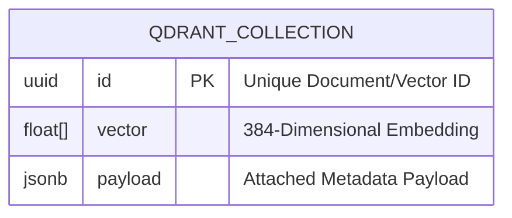

# Qdrant Vector Database Structure

The GigaData Engine utilizes **Qdrant** as its highly performant vector search engine. While PostgreSQL handles structured relational data and MinIO handles raw object storage, Qdrant is specifically dedicated to unstructured and semi-structured text. 

Its primary role is to power the **Retrieval-Augmented Generation (RAG)** pipeline for the AI Chatbot by allowing semantic similarity searches across vast agricultural knowledge bases.

## What is Stored in Qdrant?

Qdrant stores mathematical representations (embeddings) of text alongside rich JSON metadata. We partition this data into distinct **Collections**:

1. **`agronomy_manuals`**: 
   - **Content**: Paragraph-level chunks of official agricultural extension manuals, crop protection bulletins, and farming guidelines.
   - **Purpose**: Provides the ground-truth "textbook" knowledge for the AI to answer general farming questions.
2. **`pathology_diagnostics`**:
   - **Content**: Textual descriptions of localized crop disease outbreaks, symptom observations, and treatment recommendations submitted by field officers.
   - **Purpose**: Allows the AI to reference recent, real-world regional disease patterns when diagnosing a farmer's issue.
3. **`farmer_conversations`** *(Short-term TTL)*:
   - **Content**: Recent conversational history between the WhatsApp bot and specific farmers.
   - **Purpose**: Provides contextual memory so the AI can answer follow-up questions fluidly.

## Collection Configuration

- **Distance Metric**: Cosine Similarity (Optimal for semantic text matching).
- **Vector Dimensions**: 384 (Matched to the lightweight, high-speed `all-MiniLM-L6-v2` embedding model).



## Payload Schema Definition

A vector alone is just an array of numbers. The true power of the GigaData architecture comes from the **Metadata Payload** attached to each vector. This allows the API to perform pre-filtering (e.g., "only search documents relating to Maize in the Mashonaland province") before running the semantic similarity search.

```json
{
  "id": "550e8400-e29b-41d4-a716-446655440000",
  "vector": [0.034, -0.124, 0.455, "... (384 floats)"],
  "payload": {
    "text": "Maize Streak Virus (MSV) symptoms include thin, discontinuous yellow-to-white streaks running parallel along the leaf veins...",
    "crop_code": "MAIZE",
    "disease_code": "MSV_01",
    "source": "DR&SS Maize Pathology Bulletin Vol. 4",
    "expert_verified": true,
    "image_s3_path": "silver/diagnostics/processed_images/msv_sample.jpg",
    "postgres_record_id": "req-uuid-1234"
  }
}
```

## Architectural Integration Flow

Qdrant does not exist in isolation; it is deeply integrated into a **Dual-Database Architecture**:

1. **Dual Ingestion**: When a new diagnostic report is submitted via the `/api/v1/ingest/orchestrate` endpoint, the orchestrator splits the data:
   - The *unstructured text* (observations, notes) is embedded into a vector and upserted into **Qdrant**.
   - The *structured telemetry* (GPS coordinates, farmer ID, timestamp) is inserted into **PostgreSQL**.
   - Both databases share the exact same `id` UUID, ensuring the records remain perfectly linked.
2. **Media Linking**: The payload's `image_s3_path` acts as a pointer directly to the **MinIO** object storage.
3. **Retrieval (RAG)**: When a farmer asks the AI a question:
   - The API converts the question into a 384D vector.
   - It queries Qdrant for the nearest vectors, applying metadata filters (e.g., `crop_code = MAIZE`).
   - Qdrant returns the relevant `text` chunks.
   - The API injects these chunks into the LLM prompt to synthesize a grounded, highly accurate response, eliminating AI hallucinations and providing citations via the `source` payload.
